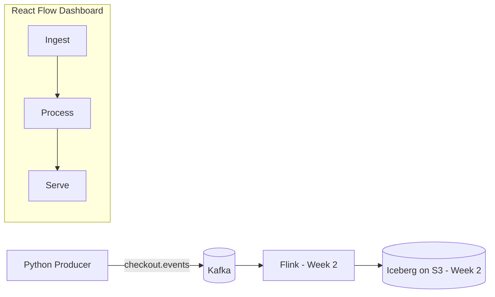

# Week 1 — Stream Generator and Lineage UI

## What this covers
- A Python producer that generates realistic checkout events onto Kafka at a configurable rate
- Fault injection (NULL values, schema drift) controlled live via `chaos.json`
- A React Flow dashboard visualizing the pipeline: Ingest -> Process -> Serve

## Architecture



## Running the generator

Start Kafka:
docker compose up -d


Activate the virtual environment and run the producer:
.venv\Scripts\Activate.ps1
python generator\producer.py --rate 2000


Arguments:
| Flag | Default | Purpose |
|---|---|---|
| `--rate` | 2000 | events/sec |
| `--bootstrap` | localhost:29092 | Kafka address |
| `--topic` | checkout.events | target topic |
| `--chaos` | generator/chaos.json | fault config path |

Tested up to 5000 events/sec on a single laptop process with delivery confirmed against Kafka offsets.

## Fault injection: chaos.json

The producer re-reads this file every second, so faults can be toggled while it's running.

```json
{
  "null_rate": 0.005,
  "drift": "none",
  "drift_rate": 1.0
}
```

| Field | Effect |
|---|---|
| `null_rate` | fraction of events with `tax_amount` set to `null` |
| `drift` | `none`, `rename` (`tax_amount` -> `tax_amt`), `retype` (`subtotal` becomes a string), or `new_column` (adds `loyalty_tier`) |
| `drift_rate` | fraction of events affected when `drift` is not `none` |

Demo: set `null_rate` to `0.5` while the producer is running to simulate the 50% NULL tax burst described in the project brief.

## Lineage UI

Run with:
cd ui
npm install
npm run dev


Shows three nodes (Ingest, Process, Serve) connected by animated edges. A demo button toggles the Process node between healthy (green) and quarantined (red, with a glow, edge turns red and stops animating). In Week 3, this state will be driven by the real circuit breaker over WebSockets instead of a button.


## Verified this week
- Producer delivers events with zero loss at up to 5000/sec (confirmed via `kafka-get-offsets.sh` before/after totals)
- `null_rate` and `drift` changes in `chaos.json` are picked up within ~1 second, live
- All three drift modes (rename, retype, new_column) confirmed to alter the event shape correctly
- UI renders the pipeline graph and node status changes propagate to edge styling