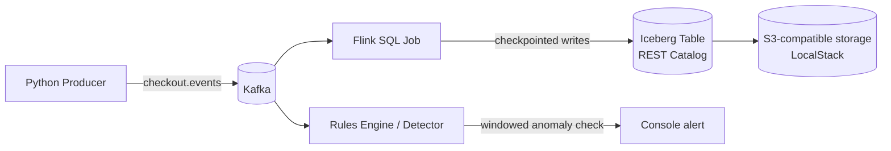

# Week 2 — Lakehouse Foundation and Data Quality Rules

## What this covers
- A real Apache Iceberg lakehouse (REST catalog + S3-compatible object storage) fed live by Apache Flink
- A Flink SQL job streaming Kafka checkout events into Iceberg with exactly-once semantics via checkpointing
- A Python data-quality rules engine that detects null rates, schema drift, and out-of-range values in near real time
- An ACID audit proving concurrent readers see a consistent, monotonically growing table while Flink writes to it

## Architecture

## A key architecture decision: local disk to S3-compatible storage

The original plan used MinIO for S3-compatible object storage. During setup, MinIO's Docker images became unavailable on Docker Hub (both `minio/minio` and `minio/mc` returned "repository does not exist" even after authenticating). Switching to a local-filesystem Iceberg catalog worked initially for table DDL, but the actual streaming writes from Flink failed with a Permission Denied error that traced back to a known compatibility issue between the JVM's file-write path and Docker Desktop's WSL2/virtiofs volume backend on Windows.

The fix was to switch to **LocalStack**, an S3-compatible emulator, and point Iceberg's `S3FileIO` at it instead of the local filesystem. This is not a workaround — it's the architecturally correct pattern for a production lakehouse, where object storage (real S3) is the standard, not local disk. In production this swaps to real AWS S3 by changing only the `s3.endpoint` and credentials.

## Running the pipeline
docker compose up -d --build
docker compose exec jobmanager ./bin/sql-client.sh -f /opt/sql/01_pipeline.sql
python generator\producer.py --rate 1000

Check the Flink dashboard at `localhost:8081` for job status, and query row counts via the SQL client (see `flink/sql/01_pipeline.sql`).

## Rules engine

`rules/engine.py` defines composable `Expectation` objects (modeled on Great Expectations' naming) and a `Suite` that evaluates a batch and returns a per-record error rate. `rules/suites.py` defines `checkout_suite`, which checks for:
- `tax_amount` existing and non-null
- `subtotal` non-null and numeric
- `total` within a sane range (0 to 100,000)
- `event_id` non-null

`rules/detector.py` consumes `checkout.events` live, batches into 5-second windows, and flags an anomaly when the record error rate exceeds 2% (`ERROR_THRESHOLD`), matching the Week 3 circuit-breaker threshold.

## Verified this week

**Streaming pipeline**
- Flink job survives sustained operation with checkpointing every 10s (confirmed running >2 minutes without restart after the storage fix)
- Row count in Iceberg climbs continuously while the generator runs, confirmed via `SELECT COUNT(*)` at two points in time

**ACID audit** (`audit/acid_audit.py`)
- 3 concurrent readers polling every 2 seconds for 60 seconds while Flink actively writes
- 0 errors during concurrent access
- 0 monotonicity violations (row count never decreased between reads)
- Result: **PASS** — Iceberg's snapshot isolation held under concurrent read/write load

**Data quality detection**
- Detector correctly identifies:
  - NULL tax_amount bursts (tested at 50% injection rate, flagged within one 5s window)
  - Schema drift via rename (`tax_amount` -> `tax_amt`), flagged at 100% failure on `expect_column_to_exist`
  - Schema drift via retype (`subtotal` as string), flagged via type check
- 10 unit tests covering the expectation engine, all passing (`rules/test_engine.py`)

## Known limitations going into Week 3
- The circuit breaker (routing bad data to a DLQ table instead of alerting) is not yet built — the detector currently only logs to console
- The lineage UI's node status is still driven by a manual toggle button, not the real detector output
- `json.ignore-parse-errors = true` on the Kafka source means malformed records currently pass through as nulls rather than being rejected outright; the DLQ logic in Week 3 will handle this properly